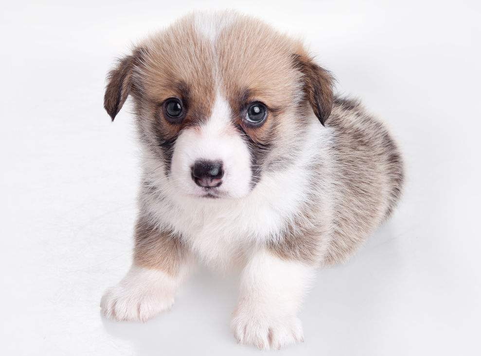

Lesson11: 图片
=================

------------------------------------------------------------------

1.语法:
-------
- 图片的语法与链接非常相似,只需要在前面添加一个\!叹号即可
- 
-------------------------------------------------------------------

2.实战:
------

<!-- 文本:可爱的狗狗,当图片被禁止或者不能显示的时候会显示 -->
<!-- 图片是不是有点太大了,很遗憾,Markdown不支持调整图片大小,请用img标签调整 -->

<!-- 更多时候,你可能想给图片加一个链接,很简单,只需要将链接文本换成图片即可 -->
<!-- 第一步: 创建链接 -->
<!--  -->
<!-- 第二步:将图片插入到链接文本中 -->

------------------------------------------------------------------

3.总结:
- 图片在使用前,请先按显示比例和大小调整好,因为Markdown暂不支持图片大小设置